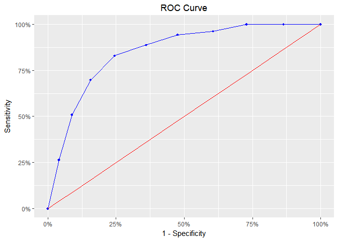
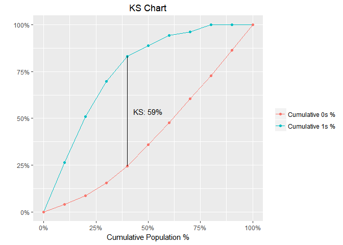
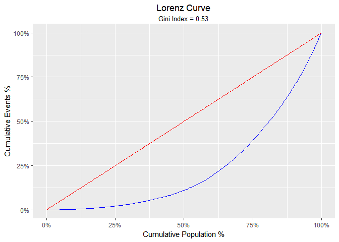

<!-- README.md is generated from README.Rmd. Please edit that file -->

## blorr: Tools for building binary logistic regression models 

**Author:** [Aravind Hebbali]()<br/> **License:**
[MIT](https://opensource.org/licenses/MIT)

[](https://cran.r-project.org/package=blorr)
[](https://travis-ci.org/rsquaredacademy/blorr)
[](https://ci.appveyor.com/project/rsquaredacademy/blorr)
[](https://codecov.io/github/rsquaredacademy/blorr?branch=master)


blorr is designed to make it easier for users, particularly
beginner/intermediate R users to build logistic regression models.

<br>

### Installation

You can install blorr from github with:

``` r
# install.packages("devtools")
devtools::install_github("rsquaredacademy/blorr")
```

<br>

### Consistent Prefix

blorr uses consistent prefix `blr_*` for easy tab completion.

<br>

### Quick Overview

#### Introduction

``` r
library(blorr)
library(magrittr)
```

``` r
# create model using glm
model <- glm(honcomp ~ female + read + science, data = hsb2,
             family = binomial(link = 'logit'))
```

<br>

#### Regression Output

``` r
blr_regress(model)
#>                              Model Overview                              
#> ------------------------------------------------------------------------
#> Data Set    Resp Var    Obs.    Df. Model    Df. Residual    Convergence 
#> ------------------------------------------------------------------------
#>   data      honcomp     200        199           196            TRUE     
#> ------------------------------------------------------------------------
#> 
#>                     Response Summary                     
#> --------------------------------------------------------
#> Outcome        Frequency        Outcome        Frequency 
#> --------------------------------------------------------
#>    0              147              1              53     
#> --------------------------------------------------------
#> 
#>                   Maximum Likelihood Estimates                    
#> -----------------------------------------------------------------
#>  Parameter     DF    Estimate    Std. Error    z value    Pr(>|z|) 
#> -----------------------------------------------------------------
#> (Intercept)    1     -12.7772       1.9755    -6.4677      0.0000 
#>   female1      1      1.4825        0.4474     3.3139       9e-04 
#>    read        1      0.1035        0.0258     4.0186       1e-04 
#>   science      1      0.0948        0.0305     3.1129      0.0019 
#> -----------------------------------------------------------------
#> 
#>                   Odds Ratio Estimates                    
#> ---------------------------------------------------------
#>  Effects          Estimate          95% Wald Conf. Limit 
#> ---------------------------------------------------------
#>  female1           4.4039          1.8955         11.0521 
#>    read            1.1091          1.0569          1.1699 
#>  science           1.0994          1.0377          1.1702 
#> ---------------------------------------------------------
#> 
#>  Association of Predicted Probabilities and Observed Responses  
#> ---------------------------------------------------------------
#> % Concordant          0.8561          Somers' D        0.7147   
#> % Discordant          0.1425          Gamma            0.7136   
#> % Tied                0.0014          Tau-a            0.2794   
#> Pairs                  7791           c                0.8568   
#> ---------------------------------------------------------------
```

<br>

#### Model Fit Statistics

``` r
blr_model_fit_stats(model)
#>                               Model Fit Statistics                                
#> ---------------------------------------------------------------------------------
#> Log-Lik Intercept Only:      -115.644    Log-Lik Full Model:              -80.118 
#> Deviance(196):                160.236    LR(3):                            71.052 
#>                                          Prob > LR:                         0.000 
#> MCFadden's R2                   0.307    McFadden's Adj R2:                 0.273 
#> ML (Cox-Snell) R2:              0.299    Cragg-Uhler(Nagelkerke) R2:        0.436 
#> McKelvey & Zavoina's R2:        0.518    Efron's R2:                        0.330 
#> Count R2:                       0.810    Adj Count R2:                      0.283 
#> BIC:                          181.430    AIC:                             168.236 
#> ---------------------------------------------------------------------------------
```

<br>

#### Confusion Matrix

``` r
blr_confusion_matrix(model)
#>                    Predicted   
#> -----------------------------
#> Observed          0         1 
#> -----------------------------
#>    0            135        12 
#>    1             26        27 
#> -----------------------------
#> 
#>   Model Performance Measures   
#> ------------------------------
#> Accuracy                0.8100 
#> Precision               0.6923 
#> Sensitivity             0.5094 
#> Specificity             0.9184 
#> Recall                  0.5094 
#> Prevalence              0.2650 
#> Detection Rate          0.1350 
#> Detection Prevalence    0.1950 
#> Balanced Accuracy       0.7139 
#> Pos Predicted Value     0.6923 
#> Neg Predicted Value     0.8385
```

<br>

#### Hosmer Lemeshow Test

``` r
blr_hosmer_lemeshow_test(model)
#>            Partition for the Hosmer & Lemeshow Test            
#> --------------------------------------------------------------
#>                         def = 1                 def = 0        
#> Group    Total    Observed    Expected    Observed    Expected 
#> --------------------------------------------------------------
#>   1       20         0          0.16         20        19.84   
#>   2       20         0          0.53         20        19.47   
#>   3       20         2          0.99         18        19.01   
#>   4       20         1          1.64         19        18.36   
#>   5       21         3          2.72         18        18.28   
#>   6       19         3          4.05         16        14.95   
#>   7       20         7          6.50         13        13.50   
#>   8       20         10         8.90         10        11.10   
#>   9       20         13        11.49         7          8.51   
#>  10       20         14        16.02         6          3.98   
#> --------------------------------------------------------------
#> 
#>      Goodness of Fit Test      
#> ------------------------------
#> Chi-Square    DF    Pr > ChiSq 
#> ------------------------------
#>   4.4998      8       0.8095   
#> ------------------------------
```

<br>

#### Gains Table

``` r
blr_gains_table(model)
#> # A tibble: 10 x 12
#>    decile total   `1`   `0`    ks    tp    tn     fp    fn sensit~ specif~
#>     <int> <int> <dbl> <dbl> <dbl> <dbl> <dbl>  <dbl> <dbl>   <dbl>   <dbl>
#>  1      1    20 14.0   6.00  22.3  14.0 141     6.00 39.0     26.4    95.9
#>  2      2    20 13.0   7.00  42.1  27.0 134    13.0  26.0     50.9    91.2
#>  3      3    20 10.0  10.0   54.2  37.0 124    23.0  16.0     69.8    84.4
#>  4      4    20  7.00 13.0   58.5  44.0 111    36.0   9.00    83.0    75.5
#>  5      5    20  3.00 17.0   52.6  47.0  94.0  53.0   6.00    88.7    63.9
#>  6      6    20  3.00 17.0   46.7  50.0  77.0  70.0   3.00    94.3    52.4
#>  7      7    20  1.00 19.0   35.7  51.0  58.0  89.0   2.00    96.2    39.5
#>  8      8    20  2.00 18.0   27.2  53.0  40.0 107     0      100      27.2
#>  9      9    20  0    20.0   13.6  53.0  20.0 127     0      100      13.6
#> 10     10    20  0    20.0    0    53.0   0   147     0      100       0  
#> # ... with 1 more variable: accuracy <dbl>
```

<br>

#### ROC Curve

``` r
model %>%
  blr_gains_table %>%
  blr_roc_curve
```

<!-- -->

<br>

#### KS Chart

``` r
model %>%
  blr_gains_table %>%
  blr_ks_chart
```

<!-- -->

<br>

#### Lorenz Curve

``` r
blr_lorenz_curve(model)
```

<!-- -->

Please note that this project is released with a [Contributor Code of
Conduct](CONDUCT.md). By participating in this project you agree to
abide by its terms.
